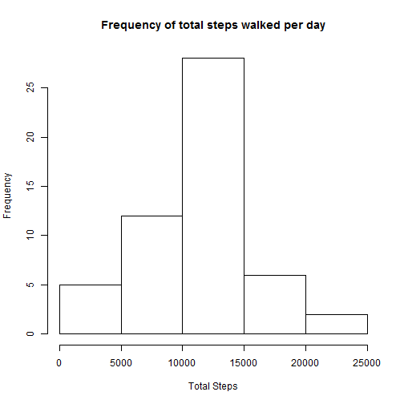
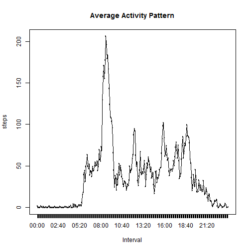
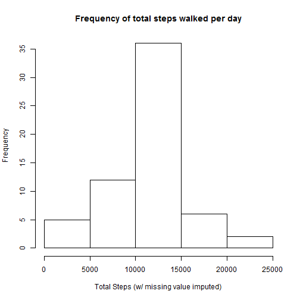
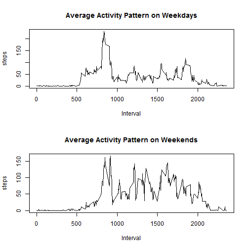

## Loading and preprocessing the data
Assuming the 'activity.csv' file is in the current working directory:

```r
data <- read.csv('activity.csv')
```

## What is mean total number of steps taken per day?

We'll aggregate the number of steps taken per day.
After that, we can easily compute the median and mean over the entire set.


```r
stepsPerDay <- aggregate(steps ~ date, data, sum)
meanStepsPerDay <- mean(stepsPerDay$steps)
medianStepsPerDay <- median(stepsPerDay$steps)
```

So the *mean* is 1.0766189 &times; 10<sup>4</sup>, and the *median*? value is 10765.

For a more comprehensive look at the frequency distribution, we can take a look at the histogram of the total number of steps per day:

```r
hist(stepsPerDay$steps, 
     main="Frequency of total steps walked per day",
     xlab="Total Steps")
```

 


## What is the average daily activity pattern?

Let's average the number of steps per interval, over all days:

```r
avgStepsPerInterval <- aggregate(steps ~ interval, data,mean)
```

and we can plot it, to have a better look:

```r
formattedIntervals <- strftime(seq(from = ISOdate(2012,10,1,hour=0),
                                   by = "5 min",length.out = 288),format="%H:%M", tz="GMT")
dataWithTime <- cbind(avgStepsPerInterval,formattedIntervals)
plot(dataWithTime[,c("formattedIntervals","steps")],
     #using type="l" in this case makes the plot look more like a scatter than a line. 
     # So instead, I'm using type="n" and adding a line later
     type="n", 
     main="Average Activity Pattern",
     xlab="Interval")
lines(dataWithTime[,c("formattedIntervals","steps")])
```

 

Note we create a matching time object vector, to label the intervals properly.

## Imputing missing values

We'll now have a look at the missing values in the data, and handle them.


```r
missing_value_count <- nrow(data[is.na(data[,"steps"]),])
```

We have 2304 rows with missing value for steps.

We'll get rid of these values using a simple strategy - for any missing steps value, we'll take the average measured for that interval, over all days, as computed above.
Choosing the average for that time interval seems reasonable, as we assume that the days with missing measurements are no exception (except for the fact that apparently the person measured didn't carry his phone on that day).

We therefore fix this with the following code:

```r
fix <- function(steps,avg) { if (is.na(steps)) avg else steps }
fixedSteps <- mapply(fix, data$steps, avgStepsPerInterval$steps)
newData <- data.frame(fixedSteps,data$date, data$interval)
names(newData) <- c("steps","date","interval")
```

As an example, the 1st row looks like this in the old data set: (NA, 2012-10-01, 0).

and looks like this in the new data set: (1.7169811, 2012-10-01, 0).

The new data set has 0 missing values for 'steps' (should be 0).

Looking at the frequencies of the total steps taken now, we can plot a histogram of the total step count using this code:

```r
newStepsPerDay <- aggregate(steps ~ date, newData, sum)
hist(newStepsPerDay$steps, 
     main="Frequency of total steps walked per day",
     xlab="Total Steps (w/ missing value imputed)")
```

 

The new mean and median are given using this calculation:

```r
newMeanStepsPerDay <- mean(newStepsPerDay$steps)
newMedianStepsPerDay <- median(newStepsPerDay$steps)
```

which results is a mean of 1.0766189 &times; 10<sup>4</sup> and a median of 1.0766189 &times; 10<sup>4</sup>.

Compared to the previous values: 
- The mean is equal to the original mean.
- The median is higher than the original median.


## Are there differences in activity patterns between weekdays and weekends?

In order to answer this question, we start by classifying each measurement, to see if it happens on a weekday or on a weekend.
We do this based in the date given in the data:

```r
wkdays <- weekdays(as.POSIXlt(newData$date))
classifyDOW <- function (dow) if ((dow == "Saturday") || (dow == "Sunday")) "weekend" else "weekday"
datawClassifiedDays <- cbind(newData,sapply(wkdays,classifyDOW))
names(datawClassifiedDays) <- c("steps","date","interval","weekpart")
```

and so, the first row would be: (1.7169811, 2012-10-01, 0, weekday).

Trying to compare weekend vs. weekday patterns, we'll have a look at the plot for the average steps taken, for all days, partitioned by the day of week classification:

```r
#Partioning and aggregating the data
wkdays<- subset(datawClassifiedDays,weekpart == "weekday",select=c("steps","date","interval"))
wkends<- subset(datawClassifiedDays,weekpart == "weekend",select=c("steps","date","interval"))

wkdays_avg <- aggregate(steps ~ interval, wkdays ,mean)
wkends_avg <- aggregate(steps ~ interval, wkends ,mean)

# and plotting it
par(mfrow = c(2,1))

plot(wkdays_avg[,c("interval","steps")],type="l",
     main="Average Activity Pattern on Weekdays",
     xlab="Interval")

plot(wkends_avg[,c("interval","steps")],type="l",
     main="Average Activity Pattern on Weekends",
     xlab="Interval")
```

 

It appears that weekends are generally more active - the morning hours look generally similar on weekends and weekdays.
But during the day, weekdays are more relaxed (less walking).
Can we deduce that this is an office worker?
